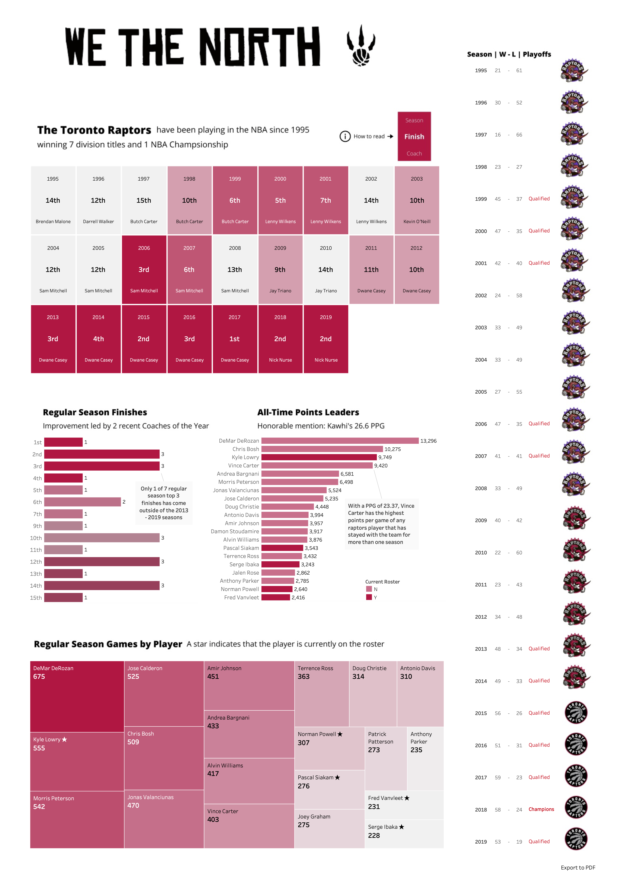

# Raptors-History
Tableau Visualization of the Toronto Raptors historical performance following the end of the 2020 season

## :bar_chart: Tableau Dashboard
Find the [live version here](https://public.tableau.com/profile/alex2816#!/vizhome/Raptors_16001361803940/Raptors)

## :mag: Methodology
Began with the official NBA website to identify key metrics and moved to other statistical websites for detailed data, including basketball-reference, real-gm, wikipedia, etc. Retrieved team and player historical data, splitting into two seperate tables for the visualization. The data was then processed and cleaned in Excel and visualized using Tableau. 

## :computer: Final Visualization

## :wave: Author
Alex Kruczkowski
